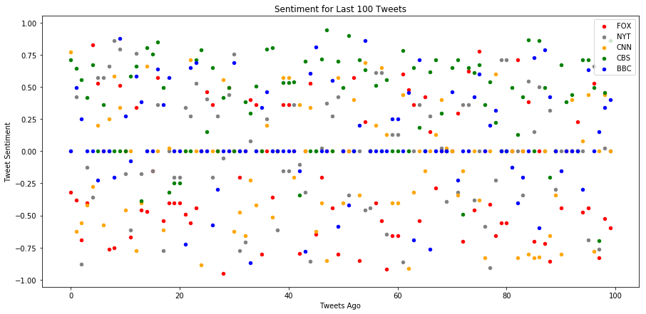

```python
#import
import pandas as pd
import matplotlib.pyplot as plt
import tweepy
import json
from vaderSentiment.vaderSentiment import SentimentIntensityAnalyzer
analyzer = SentimentIntensityAnalyzer()

from config import api_twitter
from config import api_twitter_secret
from config import api_access_token
from config import api_access_token_secret
# Your Twitter API Keys
consumer_key = api_twitter
consumer_secret = api_twitter_secret
access_token = api_access_token
access_token_secret = api_access_token_secret

# Setup Tweepy API Authentication
auth = tweepy.OAuthHandler(consumer_key, consumer_secret)
auth.set_access_token(access_token, access_token_secret)
api = tweepy.API(auth, parser=tweepy.parsers.JSONParser())

```


```python
#Let's keep our twitter targets in a list
target_list = ["@bbc", "@cnn", "@NYTimes", "@FoxNews", "@cbs"]
comp_dict = {}
pos_dict = {}
neg_dict = {}
neu_dict = {}
```


```python
#Just to make sure it's working....
#tweets = api.user_timeline(target_list[0])
#print(tweets)
#tweets[0]["text"]
```


```python
'''Your final Jupyter notebook must:

Pull last 100 tweets from each outlet.
Perform a sentiment analysis with the compound, positive, neutral, and negative scoring for each tweet.
Pull into a DataFrame the tweet's source acount, its text, its date, and its compound, positive, neutral, and negative sentiment scores.
Export the data in the DataFrame into a CSV file.
Save PNG images for each plot.'''


#let's create a function series of functions to do this.
def compoundanalysis(handle):
    print("Running compound analysis for {}".format(handle))
    compound_list = []
    oldest_tweet = None
    for x in range (0,5):
        tweet_search = api.user_timeline(handle, max_id = oldest_tweet)
        for tweet in tweet_search:
            results = analyzer.polarity_scores(tweet["text"])
            compound_list.append(results["compound"])
            oldest_tweet = tweet["id"]
    return(compound_list)

#Damn, ok, that wasn't so bad. That return really opens up some good stuff. Let's create 3 more for other returns
    
def positiveanalysis(handle):
    print("Running positive analysis for {}".format(handle))
    positive_list = []
    oldest_tweet = None
    for x in range (0,5):
        tweet_search = api.user_timeline(handle, max_id = oldest_tweet)
        for tweet in tweet_search:
            results = analyzer.polarity_scores(tweet["text"])
            positive_list.append(results["pos"])
            oldest_tweet = tweet["id"]
    return(positive_list)

def negativeanalysis(handle):
    print("Running negative analysis for {}".format(handle))
    negative_list = []
    oldest_tweet = None
    for x in range (0,5):
        tweet_search = api.user_timeline(handle, max_id = oldest_tweet)
        for tweet in tweet_search:
            results = analyzer.polarity_scores(tweet["text"])
            negative_list.append(results["neg"])
            oldest_tweet = tweet["id"]
    return(negative_list)

def neutralanalysis(handle):
    print("Running neutral analysis for {}".format(handle))
    neutral_list = []
    oldest_tweet = None
    for x in range (0,5):
        tweet_search = api.user_timeline(handle, max_id = oldest_tweet)
        for tweet in tweet_search:
            results = analyzer.polarity_scores(tweet["text"])
            neutral_list.append(results["neu"])
            oldest_tweet = tweet["id"]
    return(neutral_list)
```


```python
#Then we just do this, and build a dictionary! Ain't no thing.
for handle in target_list:
    comp_dict["comp_" + handle] = compoundanalysis(handle)
    pos_dict["pos_"+handle] = positiveanalysis(handle)
    neg_dict["neg_"+handle] = negativeanalysis(handle)
    neu_dict["neu_"+handle] = neutralanalysis(handle)
```

    Running compound analysis for @bbc
    Running positive analysis for @bbc
    Running negative analysis for @bbc
    Running neutral analysis for @bbc
    Running compound analysis for @cnn
    Running positive analysis for @cnn
    Running negative analysis for @cnn
    Running neutral analysis for @cnn
    Running compound analysis for @NYTimes
    Running positive analysis for @NYTimes
    Running negative analysis for @NYTimes
    Running neutral analysis for @NYTimes
    Running compound analysis for @FoxNews
    Running positive analysis for @FoxNews
    Running negative analysis for @FoxNews
    Running neutral analysis for @FoxNews
    Running compound analysis for @cbs
    Running positive analysis for @cbs
    Running negative analysis for @cbs
    Running neutral analysis for @cbs
    


```python
#Turn it all into a dataframe by taking a list of those dictionaries

#So, ok, this was a total pain in the ass. There MUST be a better way of doing this, but I'm tired and can't think of it.
tweet_df = pd.DataFrame(comp_dict) #.append(pos_dict["pos_@bbc"]) #.append(pos_dict)
for handle in target_list:
    tweet_df["pos_" + handle] = pos_dict["pos_" + handle]
    tweet_df["neg_" + handle] = neg_dict["neg_" + handle]
    tweet_df["neu_" + handle] = neu_dict["neu_" + handle]
print(tweet_df)
tweet_df.to_csv("tweet_sentiment.csv")
```

        comp_@FoxNews  comp_@NYTimes  comp_@bbc  comp_@cbs  comp_@cnn  pos_@bbc  \
    0         -0.3182         0.0000     0.0000     0.7096     0.7717     0.000   
    1         -0.3818         0.4215     0.4939     0.6467    -0.6249     0.314   
    2         -0.6908        -0.8779     0.2500     0.5562    -0.5574     0.147   
    3         -0.4019        -0.1280     0.0000     0.4199    -0.4215     0.000   
    4          0.8271        -0.3612     0.0000     0.6696    -0.2732     0.000   
    5          0.5267         0.5719    -0.2263     0.0000     0.2023     0.000   
    6          0.0000         0.5719     0.0000     0.3612    -0.5719     0.000   
    7         -0.7650         0.6597     0.0000     0.0000     0.2500     0.000   
    8         -0.7506         0.8591    -0.2023     0.0000     0.5859     0.000   
    9          0.5106         0.7964     0.8750     0.0000     0.3400     0.393   
    10         0.0000        -0.1779     0.2732     0.0000    -0.4588     0.512   
    11        -0.6705        -0.6124    -0.0772     0.5859     0.0000     0.000   
    12         0.3400         0.7579     0.5859     0.6597    -0.7717     0.213   
    13        -0.4588        -0.1779     0.3818    -0.3875    -0.4019     0.120   
    14        -0.4708         0.0000     0.0000     0.8070     0.6588     0.000   
    15        -0.1531        -0.1531     0.0000     0.7568     0.0000     0.000   
    16         0.5719         0.3612     0.6369     0.8495     0.0000     0.208   
    17        -0.5423        -0.7717     0.3612     0.4926    -0.6124     0.217   
    18        -0.4019         0.0000     0.5719    -0.3182     0.0258     0.252   
    19        -0.4019        -0.2023     0.0000    -0.2500     0.0000     0.000   
    20        -0.4019        -0.2023     0.0000    -0.2500     0.0000     0.000   
    21        -0.4939         0.3400    -0.7269     0.0000     0.0000     0.072   
    22        -0.5574         0.2732     0.6515     0.0000     0.7108     0.419   
    23        -0.4404         0.5256     0.6908     0.7096     0.0000     0.241   
    24         0.0000         0.0000     0.0000     0.7906    -0.8834     0.000   
    25         0.4588         0.4069     0.0000     0.1513     0.0000     0.000   
    26         0.3612        -0.2023    -0.5719     0.6486     0.0000     0.000   
    27         0.0000         0.2732    -0.2960     0.0000     0.0000     0.098   
    28        -0.9538        -0.0516     0.0000     0.4199     0.5574     0.000   
    29         0.4939         0.4404     0.0000     0.4926     0.0000     0.000   
    ..            ...            ...        ...        ...        ...       ...   
    70         0.0000         0.0000     0.4588     0.6514     0.0000     0.250   
    71         0.2960        -0.3182    -0.2263     0.7088    -0.3400     0.000   
    72        -0.7003         0.3612     0.0000    -0.4939    -0.1531     0.000   
    73         0.6249         0.3612     0.0000     0.6514     0.0000     0.000   
    74        -0.4588        -0.3818     0.4215     0.6115     0.0000     0.203   
    75         0.7783         0.0000     0.6027     0.6696    -0.3818     0.157   
    76         0.0000        -0.5849     0.0000     0.3612    -0.8271     0.000   
    77        -0.4137        -0.9062     0.2023     0.5390     0.0000     0.076   
    78        -0.6597        -0.2263     0.3164     0.2244     0.5994     0.094   
    79        -0.5574         0.7096     0.0000     0.0000     0.0000     0.000   
    80        -0.5574         0.7096     0.0000     0.0000     0.0000     0.000   
    81         0.0000         0.0000    -0.1280     0.4926     0.0000     0.000   
    82         0.7096         0.0000    -0.4003     0.1275    -0.8271     0.000   
    83         0.0000        -0.3400    -0.2023     0.4215     0.0000     0.146   
    84         0.3818         0.5423     0.0000     0.8658    -0.8020     0.000   
    85        -0.7003         0.1531     0.7269     0.0000    -0.8316     0.357   
    86         0.0000         0.5023    -0.5994     0.8625    -0.8225     0.000   
    87        -0.7184         0.0000     0.7906     0.4926     0.0000     0.292   
    88        -0.8555         0.3182     0.4215    -0.2023    -0.6597     0.237   
    89         0.0000        -0.2960     0.0000     0.0000    -0.3400     0.000   
    90        -0.4404         0.0000    -0.1531     0.6705    -0.8020     0.000   
    91         0.0000         0.0000     0.0000     0.3818     0.0000     0.000   
    92         0.0000         0.0000     0.0000     0.4404     0.4019     0.000   
    93         0.2263         0.0000     0.0000     0.0000     0.0000     0.000   
    94        -0.4767         0.0000    -0.2960     0.7096     0.0772     0.000   
    95        -0.4404        -0.6908     0.6360     0.7096     0.4404     0.271   
    96         0.5267         0.6597     0.0000     0.4939    -0.7783     0.000   
    97        -0.8271        -0.7650     0.1531    -0.6981     0.0000     0.103   
    98        -0.5267         0.0258     0.3400     0.4547     0.4404     0.103   
    99        -0.5994         0.0000     0.4019     0.8591     0.0000     0.109   
    
        neg_@bbc  neu_@bbc  pos_@cnn  neg_@cnn  neu_@cnn  pos_@NYTimes  \
    0      0.000     1.000     0.358     0.000     0.642         0.000   
    1      0.000     0.686     0.000     0.389     0.611         0.135   
    2      0.088     0.765     0.000     0.167     0.833         0.000   
    3      0.000     1.000     0.000     0.177     0.823         0.000   
    4      0.000     1.000     0.097     0.143     0.759         0.000   
    5      0.106     0.894     0.122     0.000     0.878         0.291   
    6      0.000     1.000     0.000     0.236     0.764         0.316   
    7      0.000     1.000     0.163     0.115     0.721         0.231   
    8      0.189     0.811     0.153     0.000     0.847         0.422   
    9      0.000     0.607     0.337     0.218     0.446         0.542   
    10     0.000     0.488     0.000     0.250     0.750         0.000   
    11     0.064     0.936     0.000     0.000     1.000         0.000   
    12     0.000     0.787     0.000     0.427     0.573         0.228   
    13     0.000     0.880     0.000     0.197     0.803         0.167   
    14     0.000     1.000     0.239     0.000     0.761         0.000   
    15     0.000     1.000     0.000     0.000     1.000         0.154   
    16     0.000     0.792     0.000     0.000     1.000         0.168   
    17     0.000     0.783     0.000     0.417     0.583         0.000   
    18     0.000     0.748     0.170     0.164     0.667         0.000   
    19     0.000     1.000     0.000     0.000     1.000         0.080   
    20     0.000     1.000     0.000     0.000     1.000         0.080   
    21     0.405     0.523     0.000     0.000     1.000         0.107   
    22     0.000     0.581     0.237     0.000     0.763         0.174   
    23     0.000     0.759     0.000     0.000     1.000         0.175   
    24     0.000     1.000     0.000     0.442     0.558         0.000   
    25     0.000     1.000     0.000     0.000     1.000         0.146   
    26     0.222     0.778     0.000     0.000     1.000         0.081   
    27     0.154     0.748     0.000     0.000     1.000         0.100   
    28     0.000     1.000     0.224     0.071     0.706         0.101   
    29     0.000     1.000     0.000     0.000     1.000         0.132   
    ..       ...       ...       ...       ...       ...           ...   
    70     0.000     0.750     0.000     0.000     1.000         0.000   
    71     0.119     0.881     0.000     0.107     0.893         0.000   
    72     0.000     1.000     0.099     0.132     0.769         0.185   
    73     0.000     1.000     0.000     0.000     1.000         0.172   
    74     0.000     0.797     0.000     0.000     1.000         0.000   
    75     0.000     0.843     0.000     0.224     0.776         0.000   
    76     0.000     1.000     0.000     0.352     0.648         0.000   
    77     0.000     0.924     0.000     0.000     1.000         0.000   
    78     0.000     0.906     0.380     0.000     0.620         0.000   
    79     0.000     1.000     0.000     0.000     1.000         0.269   
    80     0.000     1.000     0.000     0.000     1.000         0.269   
    81     0.091     0.909     0.000     0.000     1.000         0.000   
    82     0.114     0.886     0.000     0.314     0.686         0.000   
    83     0.229     0.625     0.000     0.000     1.000         0.000   
    84     0.000     1.000     0.000     0.275     0.725         0.175   
    85     0.000     0.643     0.000     0.291     0.709         0.096   
    86     0.262     0.738     0.000     0.297     0.703         0.129   
    87     0.000     0.708     0.000     0.000     1.000         0.000   
    88     0.000     0.763     0.000     0.221     0.779         0.099   
    89     0.000     1.000     0.000     0.138     0.862         0.000   
    90     0.096     0.904     0.000     0.365     0.635         0.000   
    91     0.000     1.000     0.000     0.000     1.000         0.000   
    92     0.000     1.000     0.207     0.000     0.793         0.000   
    93     0.000     1.000     0.000     0.000     1.000         0.000   
    94     0.121     0.879     0.166     0.200     0.634         0.000   
    95     0.000     0.729     0.132     0.000     0.868         0.000   
    96     0.000     1.000     0.134     0.303     0.563         0.231   
    97     0.000     0.897     0.000     0.000     1.000         0.000   
    98     0.000     0.897     0.244     0.000     0.756         0.147   
    99     0.000     0.891     0.000     0.000     1.000         0.000   
    
        neg_@NYTimes  neu_@NYTimes  pos_@FoxNews  neg_@FoxNews  neu_@FoxNews  \
    0          0.000         1.000         0.000         0.126         0.874   
    1          0.000         0.865         0.000         0.206         0.794   
    2          0.336         0.664         0.000         0.217         0.783   
    3          0.158         0.842         0.000         0.162         0.838   
    4          0.185         0.815         0.435         0.000         0.565   
    5          0.000         0.709         0.159         0.000         0.841   
    6          0.000         0.684         0.000         0.000         1.000   
    7          0.000         0.769         0.000         0.306         0.694   
    8          0.000         0.578         0.000         0.314         0.686   
    9          0.000         0.458         0.268         0.000         0.732   
    10         0.159         0.841         0.000         0.000         1.000   
    11         0.357         0.643         0.000         0.310         0.690   
    12         0.000         0.772         0.098         0.000         0.902   
    13         0.195         0.637         0.000         0.158         0.842   
    14         0.000         1.000         0.109         0.223         0.668   
    15         0.187         0.659         0.000         0.118         0.882   
    16         0.079         0.753         0.270         0.000         0.730   
    17         0.427         0.573         0.000         0.241         0.759   
    18         0.000         1.000         0.113         0.209         0.678   
    19         0.118         0.802         0.000         0.162         0.838   
    20         0.118         0.802         0.000         0.162         0.838   
    21         0.000         0.893         0.154         0.352         0.494   
    22         0.000         0.826         0.000         0.205         0.795   
    23         0.000         0.825         0.000         0.162         0.838   
    24         0.000         1.000         0.000         0.000         1.000   
    25         0.121         0.732         0.158         0.000         0.842   
    26         0.112         0.808         0.128         0.000         0.872   
    27         0.000         0.900         0.000         0.000         1.000   
    28         0.112         0.787         0.000         0.464         0.536   
    29         0.000         0.868         0.127         0.000         0.873   
    ..           ...           ...           ...           ...           ...   
    70         0.000         1.000         0.000         0.000         1.000   
    71         0.161         0.839         0.122         0.068         0.811   
    72         0.000         0.815         0.000         0.453         0.547   
    73         0.000         0.828         0.186         0.000         0.814   
    74         0.133         0.867         0.000         0.158         0.842   
    75         0.000         1.000         0.343         0.000         0.657   
    76         0.210         0.790         0.000         0.000         1.000   
    77         0.637         0.363         0.000         0.116         0.884   
    78         0.147         0.853         0.000         0.310         0.690   
    79         0.000         0.731         0.000         0.217         0.783   
    80         0.000         0.731         0.000         0.217         0.783   
    81         0.000         1.000         0.000         0.000         1.000   
    82         0.000         1.000         0.306         0.072         0.622   
    83         0.231         0.769         0.000         0.000         1.000   
    84         0.053         0.772         0.178         0.000         0.822   
    85         0.000         0.904         0.000         0.420         0.580   
    86         0.000         0.871         0.000         0.000         1.000   
    87         0.000         1.000         0.000         0.273         0.727   
    88         0.000         0.901         0.000         0.461         0.539   
    89         0.180         0.820         0.000         0.000         1.000   
    90         0.000         1.000         0.000         0.162         0.838   
    91         0.000         1.000         0.000         0.000         1.000   
    92         0.000         1.000         0.000         0.000         1.000   
    93         0.000         1.000         0.286         0.238         0.476   
    94         0.000         1.000         0.000         0.237         0.763   
    95         0.207         0.793         0.000         0.225         0.775   
    96         0.000         0.769         0.159         0.000         0.841   
    97         0.485         0.515         0.048         0.384         0.568   
    98         0.142         0.711         0.000         0.134         0.866   
    99         0.000         1.000         0.000         0.259         0.741   
    
        pos_@cbs  neg_@cbs  neu_@cbs  
    0      0.258     0.000     0.742  
    1      0.263     0.000     0.737  
    2      0.146     0.000     0.854  
    3      0.108     0.000     0.892  
    4      0.183     0.000     0.817  
    5      0.000     0.000     1.000  
    6      0.106     0.000     0.894  
    7      0.000     0.000     1.000  
    8      0.000     0.000     1.000  
    9      0.000     0.000     1.000  
    10     0.000     0.000     1.000  
    11     0.194     0.000     0.806  
    12     0.241     0.000     0.759  
    13     0.074     0.157     0.769  
    14     0.313     0.000     0.687  
    15     0.288     0.000     0.712  
    16     0.366     0.000     0.634  
    17     0.197     0.000     0.803  
    18     0.000     0.095     0.905  
    19     0.000     0.133     0.867  
    20     0.000     0.133     0.867  
    21     0.000     0.000     1.000  
    22     0.000     0.000     1.000  
    23     0.258     0.000     0.742  
    24     0.421     0.000     0.579  
    25     0.116     0.092     0.792  
    26     0.202     0.000     0.798  
    27     0.000     0.000     1.000  
    28     0.113     0.000     0.887  
    29     0.127     0.000     0.873  
    ..       ...       ...       ...  
    70     0.178     0.000     0.822  
    71     0.237     0.000     0.763  
    72     0.077     0.157     0.766  
    73     0.194     0.000     0.806  
    74     0.266     0.000     0.734  
    75     0.219     0.000     0.781  
    76     0.143     0.000     0.857  
    77     0.179     0.000     0.821  
    78     0.083     0.000     0.917  
    79     0.000     0.000     1.000  
    80     0.000     0.000     1.000  
    81     0.117     0.000     0.883  
    82     0.113     0.092     0.795  
    83     0.177     0.000     0.823  
    84     0.447     0.000     0.553  
    85     0.000     0.000     1.000  
    86     0.336     0.000     0.664  
    87     0.132     0.000     0.868  
    88     0.150     0.230     0.619  
    89     0.000     0.000     1.000  
    90     0.244     0.000     0.756  
    91     0.167     0.000     0.833  
    92     0.116     0.000     0.884  
    93     0.000     0.000     1.000  
    94     0.247     0.000     0.753  
    95     0.282     0.000     0.718  
    96     0.151     0.000     0.849  
    97     0.000     0.210     0.790  
    98     0.159     0.092     0.749  
    99     0.538     0.000     0.462  
    
    [100 rows x 20 columns]
    


```python
comp_df = pd.DataFrame(comp_dict)
comp_df = comp_df.rename(columns = {"comp_@FoxNews" : "Fox News", "comp_@NYTimes" : "New York Times", "comp_@bbc": "BBC", "comp_@cbs": "CBS", "comp_@cnn":"CNN"})

```


```python
#ax_fox = comp_df.plot.scatter(x = index, y='Fox News', color='red')
comp_df_scatter = comp_df.reset_index()
#comp_df_scatter.head()
ax_fox = comp_df_scatter.plot(kind = "scatter", x= "index",  y= "Fox News", c = "red", label = "FOX", figsize = (15,7))
ax_NYT = comp_df_scatter.plot(kind = "scatter", x= "index",  y= "New York Times", c = "grey", ax = ax_fox, label = "NYT")
ax_CNN = comp_df_scatter.plot(kind = "scatter", x= "index",  y= "CNN", c = "orange", ax = ax_fox, label = "CNN")
ax_CBS = comp_df_scatter.plot(kind = "scatter", x= "index",  y= "CBS", c = "green", ax = ax_fox, label = "CBS")
ax_BBC = comp_df_scatter.plot(kind = "scatter", x= "index",  y= "BBC", c = "blue", ax = ax_fox, label = "BBC")
ax_fox.set_ylabel("Tweet Sentiment")
ax_fox.set_xlabel("Tweets Ago")
ax_fox.set_title("Sentiment for Last 100 Tweets")
plt.show()
plt.savefig('sentiment_scatter.png')

#df.plot.scatter(x='c', y='d', color='DarkGreen', label='Group 2', ax=ax)
```





    <matplotlib.figure.Figure at 0x1fde91b7198>


```python
avg_df = comp_df.mean(0)
bar_plot = avg_df.plot(kind = "bar")
bar_plot.set_ylabel("Mean Compound Sentiment")
bar_plot.set_title("Aggregated Tweet Sentiment")
plt.savefig('sentiment_bar.png')

```


