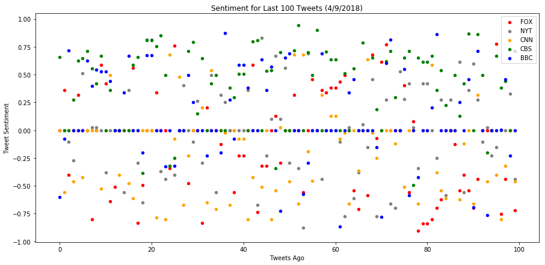
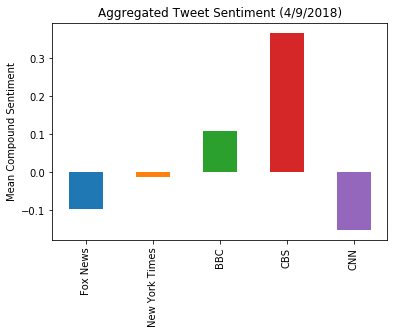

```python
print("Observation 1: Quick immediate observations - Fox and CNN are pretty dour, CBS is pretty upbeat")
print("Observation 2: time ranges are radically different. Fox tweets pretty quick, BBC only has a couple per day")
print("Observation 3: Gotta be honest, I really don't like scatter charts for this. There's so much noise as to be almost meaningless. Tweets are all over the map.")
```

    Observation 1: Quick immediate observations - Fox and CNN are pretty dour, CBS is pretty upbeat
    Observation 2: time ranges are radically different. Fox tweets pretty quick, BBC only has a couple per day
    Observation 3: Gotta be honest, I really don't like scatter charts for this. There's so much noise as to be almost meaningless. Tweets are all over the map.
    


```python
#import
import pandas as pd
import matplotlib.pyplot as plt
import tweepy
import json
from vaderSentiment.vaderSentiment import SentimentIntensityAnalyzer
analyzer = SentimentIntensityAnalyzer()

from config import api_twitter
from config import api_twitter_secret
from config import api_access_token
from config import api_access_token_secret
# Your Twitter API Keys
consumer_key = api_twitter
consumer_secret = api_twitter_secret
access_token = api_access_token
access_token_secret = api_access_token_secret

# Setup Tweepy API Authentication
auth = tweepy.OAuthHandler(consumer_key, consumer_secret)
auth.set_access_token(access_token, access_token_secret)
api = tweepy.API(auth, parser=tweepy.parsers.JSONParser())

```


```python
#Let's keep our twitter targets in a list
target_list = ["@bbc", "@cnn", "@NYTimes", "@FoxNews", "@cbs"]
comp_dict = {}
pos_dict = {}
neg_dict = {}
neu_dict = {}
```


```python
#Just to make sure it's working....
tweets = api.user_timeline(target_list[0])
#print(tweets)
tweets[0]["text"]
```


    "In this five-part immersive living history series, the training programme of one of World War Two's most covert org… https://t.co/WMq4ME93CR"


```python
'''Your final Jupyter notebook must:

Pull last 100 tweets from each outlet.
Perform a sentiment analysis with the compound, positive, neutral, and negative scoring for each tweet.
Pull into a DataFrame the tweet's source acount, its text, its date, and its compound, positive, neutral, and negative sentiment scores.
Export the data in the DataFrame into a CSV file.
Save PNG images for each plot.'''


#let's create a function series of functions to do this.
def compoundanalysis(handle):
    print("Running compound analysis for {}".format(handle))
    compound_list = []
    oldest_tweet = None
    for x in range (0,5):
        tweet_search = api.user_timeline(handle, max_id = oldest_tweet)
        for tweet in tweet_search:
            results = analyzer.polarity_scores(tweet["text"])
            compound_list.append(results["compound"])
            oldest_tweet = tweet["id"]
    return(compound_list)

#Damn, ok, that wasn't so bad. That return really opens up some good stuff. Let's create 3 more for other returns

#Reflection: I could easily (probably MORE easily...) have done this all as one function.... Oh well.
    
def positiveanalysis(handle):
    print("Running positive analysis for {}".format(handle))
    positive_list = []
    oldest_tweet = None
    for x in range (0,5):
        tweet_search = api.user_timeline(handle, max_id = oldest_tweet)
        for tweet in tweet_search:
            results = analyzer.polarity_scores(tweet["text"])
            positive_list.append(results["pos"])
            oldest_tweet = tweet["id"]
    return(positive_list)

def negativeanalysis(handle):
    print("Running negative analysis for {}".format(handle))
    negative_list = []
    oldest_tweet = None
    for x in range (0,5):
        tweet_search = api.user_timeline(handle, max_id = oldest_tweet)
        for tweet in tweet_search:
            results = analyzer.polarity_scores(tweet["text"])
            negative_list.append(results["neg"])
            oldest_tweet = tweet["id"]
    return(negative_list)

def neutralanalysis(handle):
    print("Running neutral analysis for {}".format(handle))
    neutral_list = []
    oldest_tweet = None
    for x in range (0,5):
        tweet_search = api.user_timeline(handle, max_id = oldest_tweet)
        for tweet in tweet_search:
            results = analyzer.polarity_scores(tweet["text"])
            neutral_list.append(results["neu"])
            oldest_tweet = tweet["id"]
    return(neutral_list)
```


```python
#Then we just do this, and build a dictionary! Ain't no thing.
for handle in target_list:
    comp_dict["comp_" + handle] = compoundanalysis(handle)
    pos_dict["pos_"+handle] = positiveanalysis(handle)
    neg_dict["neg_"+handle] = negativeanalysis(handle)
    neu_dict["neu_"+handle] = neutralanalysis(handle)
```

    Running compound analysis for @bbc
    Running positive analysis for @bbc
    Running negative analysis for @bbc
    Running neutral analysis for @bbc
    Running compound analysis for @cnn
    Running positive analysis for @cnn
    Running negative analysis for @cnn
    Running neutral analysis for @cnn
    Running compound analysis for @NYTimes
    Running positive analysis for @NYTimes
    Running negative analysis for @NYTimes
    Running neutral analysis for @NYTimes
    Running compound analysis for @FoxNews
    Running positive analysis for @FoxNews
    Running negative analysis for @FoxNews
    Running neutral analysis for @FoxNews
    Running compound analysis for @cbs
    Running positive analysis for @cbs
    Running negative analysis for @cbs
    Running neutral analysis for @cbs
    


```python
#Turn it all into a dataframe by taking a list of those dictionaries

#So, ok, this was a total pain in the ass. There MUST be a better way of doing this, but I'm tired and can't think of it.
tweet_df = pd.DataFrame(comp_dict) #.append(pos_dict["pos_@bbc"]) #.append(pos_dict)
for handle in target_list:
    tweet_df["pos_" + handle] = pos_dict["pos_" + handle]
    tweet_df["neg_" + handle] = neg_dict["neg_" + handle]
    tweet_df["neu_" + handle] = neu_dict["neu_" + handle]
print(tweet_df)
tweet_df.to_csv("tweet_sentiment.csv")
```

        comp_@FoxNews  comp_@NYTimes  comp_@bbc  comp_@cbs  comp_@cnn  pos_@bbc  \
    0          0.0000         0.0000    -0.5994     0.6597     0.0000     0.000   
    1          0.3612         0.0000    -0.0772     0.0000    -0.5574     0.000   
    2         -0.4019        -0.1027     0.7184     0.0000     0.0000     0.273   
    3          0.0000        -0.2732     0.0000     0.2732    -0.4588     0.000   
    4          0.3182         0.0000     0.0000     0.6239     0.0000     0.000   
    5          0.0000         0.5106     0.0000     0.6467    -0.4215     0.000   
    6          0.0000         0.0000     0.6239     0.7096     0.0000     0.506   
    7         -0.8020         0.0258     0.4003     0.5562     0.0000     0.144   
    8          0.0000         0.0258     0.5411     0.4199     0.0000     0.189   
    9          0.5859         0.0000     0.5267     0.6696    -0.5267     0.207   
    10         0.4215        -0.3818     0.5267     0.0000     0.0000     0.145   
    11        -0.6369         0.0000     0.4404     0.3612     0.4939     0.293   
    12        -0.5106         0.0000     0.0000     0.0000     0.0000     0.000   
    13         0.0000         0.0000     0.0000     0.0000    -0.4019     0.000   
    14         0.0000        -0.5574     0.3400     0.0000     0.0000     0.112   
    15         0.0000         0.3612     0.6705     0.0000    -0.4767     0.208   
    16         0.5574         0.0000     0.0000     0.5859    -0.6124     0.000   
    17        -0.8360        -0.2960     0.0000     0.6597     0.0000     0.000   
    18        -0.4939        -0.6486    -0.2023    -0.3875     0.0000     0.068   
    19         0.0000         0.8126     0.6757     0.8070     0.0000     0.268   
    20         0.0000         0.8126     0.6757     0.8070     0.0000     0.268   
    21         0.3400         0.0000     0.0000     0.7568    -0.7845     0.000   
    22         0.0000        -0.3716     0.0000     0.8495     0.0000     0.000   
    23         0.0000        -0.4404    -0.3252     0.4926    -0.8020     0.000   
    24        -0.3400        -0.3182     0.0000    -0.3182     0.6808     0.000   
    25         0.7579        -0.4019    -0.3182    -0.2500    -0.0772     0.000   
    26         0.0000         0.0000     0.0000     0.0000     0.4767     0.000   
    27         0.0000         0.4019     0.0000     0.0000    -0.6705     0.000   
    28        -0.4767         0.0000     0.4939     0.7096    -0.2263     0.314   
    29         0.0000        -0.1027     0.2500     0.7906     0.0000     0.147   
    ..            ...            ...        ...        ...        ...       ...   
    70         0.6124         0.0000    -0.7777     0.0000     0.0000     0.047   
    71         0.7713         0.2732     0.6037     0.6166     0.0000     0.360   
    72         0.0000        -0.6597     0.8126     0.7096     0.0000     0.280   
    73         0.0000        -0.7003     0.0000     0.2960    -0.1226     0.000   
    74         0.0000         0.5267     0.0000     0.0000     0.0000     0.000   
    75         0.4019         0.2776     0.5499     0.6514    -0.5106     0.385   
    76        -0.5574         0.4215    -0.5849     0.7088     0.0000     0.130   
    77         0.0772         0.0258     0.0000    -0.4939     0.0000     0.000   
    78        -0.9062        -0.3400    -0.4215     0.6514    -0.6597     0.088   
    79        -0.8402         0.4215     0.0000     0.6115     0.0000     0.000   
    80        -0.8402         0.4215     0.0000     0.6115     0.0000     0.000   
    81        -0.8020         0.0000     0.2023     0.6696     0.5859     0.101   
    82        -0.7003        -0.2500     0.8617     0.3612    -0.3818     0.311   
    83        -0.6249         0.2732     0.0000     0.5390    -0.5423     0.000   
    84         0.0000        -0.5859     0.0000     0.2244    -0.6124     0.000   
    85         0.0000         0.2732     0.0000     0.0000     0.0000     0.000   
    86        -0.1280         0.0000     0.0000     0.4926     0.0000     0.000   
    87        -0.5423         0.6124     0.2500     0.1275    -0.6249     0.095   
    88        -0.4019        -0.5574     0.0000     0.4215    -0.1226     0.000   
    89        -0.5423         0.3612     0.4579     0.8658     0.0000     0.154   
    90        -0.7003         0.5994    -0.6908     0.0000    -0.6597     0.000   
    91        -0.4404         0.2732     0.7096     0.8625     0.3182     0.371   
    92         0.0000        -0.1027     0.0000     0.4926     0.0000     0.000   
    93         0.0000         0.0258    -0.7650    -0.2023    -0.4588     0.000   
    94         0.0000        -0.2263     0.0000     0.0000     0.0000     0.000   
    95         0.7783        -0.1531     0.0000     0.6705    -0.4019     0.000   
    96        -0.7506         0.0000     0.0028     0.3818    -0.8020     0.159   
    97        -0.4404         0.0000     0.4588     0.4404    -0.3182     0.250   
    98         0.0000         0.3254    -0.2263     0.0000     0.0000     0.000   
    99        -0.7184        -0.4404     0.0000     0.7096    -0.4588     0.000   
    
        neg_@bbc  neu_@bbc  pos_@cnn  neg_@cnn  neu_@cnn  pos_@NYTimes  \
    0      0.170     0.830     0.000     0.000     1.000         0.000   
    1      0.064     0.936     0.000     0.146     0.854         0.000   
    2      0.000     0.727     0.000     0.000     1.000         0.223   
    3      0.000     1.000     0.077     0.218     0.704         0.208   
    4      0.000     1.000     0.000     0.000     1.000         0.000   
    5      0.000     1.000     0.094     0.209     0.697         0.125   
    6      0.000     0.494     0.000     0.000     1.000         0.000   
    7      0.000     0.856     0.000     0.000     1.000         0.117   
    8      0.000     0.811     0.000     0.000     1.000         0.061   
    9      0.000     0.793     0.000     0.206     0.794         0.000   
    10     0.000     0.855     0.000     0.000     1.000         0.070   
    11     0.000     0.707     0.132     0.000     0.868         0.000   
    12     0.000     1.000     0.000     0.000     1.000         0.000   
    13     0.000     1.000     0.096     0.174     0.731         0.000   
    14     0.000     0.888     0.000     0.000     1.000         0.000   
    15     0.000     0.792     0.000     0.154     0.846         0.111   
    16     0.000     1.000     0.000     0.217     0.783         0.000   
    17     0.000     1.000     0.000     0.000     1.000         0.000   
    18     0.098     0.833     0.228     0.192     0.580         0.000   
    19     0.083     0.649     0.000     0.000     1.000         0.280   
    20     0.083     0.649     0.000     0.000     1.000         0.280   
    21     0.000     1.000     0.000     0.331     0.669         0.000   
    22     0.000     1.000     0.000     0.000     1.000         0.120   
    23     0.109     0.891     0.000     0.387     0.613         0.000   
    24     0.000     1.000     0.219     0.000     0.781         0.000   
    25     0.103     0.897     0.000     0.075     0.925         0.000   
    26     0.000     1.000     0.140     0.000     0.860         0.000   
    27     0.000     1.000     0.000     0.184     0.816         0.119   
    28     0.000     0.686     0.000     0.095     0.905         0.000   
    29     0.088     0.765     0.000     0.000     1.000         0.096   
    ..       ...       ...       ...       ...       ...           ...   
    70     0.332     0.621     0.000     0.000     1.000         0.000   
    71     0.000     0.640     0.000     0.000     1.000         0.100   
    72     0.000     0.720     0.000     0.000     1.000         0.000   
    73     0.000     1.000     0.000     0.063     0.937         0.000   
    74     0.000     1.000     0.000     0.000     1.000         0.185   
    75     0.282     0.332     0.121     0.275     0.604         0.113   
    76     0.310     0.559     0.000     0.000     1.000         0.128   
    77     0.000     1.000     0.000     0.000     1.000         0.061   
    78     0.171     0.741     0.000     0.252     0.748         0.086   
    79     0.000     1.000     0.000     0.000     1.000         0.141   
    80     0.000     1.000     0.000     0.000     1.000         0.141   
    81     0.000     0.899     0.241     0.000     0.759         0.000   
    82     0.000     0.689     0.000     0.178     0.822         0.000   
    83     0.000     1.000     0.000     0.231     0.769         0.100   
    84     0.000     1.000     0.000     0.417     0.583         0.000   
    85     0.000     1.000     0.000     0.000     1.000         0.174   
    86     0.000     1.000     0.000     0.000     1.000         0.000   
    87     0.000     0.905     0.000     0.186     0.814         0.208   
    88     0.000     1.000     0.000     0.066     0.934         0.135   
    89     0.067     0.779     0.000     0.000     1.000         0.209   
    90     0.217     0.783     0.114     0.318     0.568         0.246   
    91     0.000     0.629     0.119     0.000     0.881         0.174   
    92     0.000     1.000     0.000     0.000     1.000         0.132   
    93     0.320     0.680     0.000     0.160     0.840         0.061   
    94     0.000     1.000     0.000     0.000     1.000         0.067   
    95     0.000     1.000     0.000     0.153     0.847         0.000   
    96     0.118     0.724     0.000     0.444     0.556         0.000   
    97     0.000     0.750     0.126     0.246     0.628         0.000   
    98     0.119     0.881     0.000     0.000     1.000         0.104   
    99     0.000     1.000     0.000     0.250     0.750         0.134   
    
        neg_@NYTimes  neu_@NYTimes  pos_@FoxNews  neg_@FoxNews  neu_@FoxNews  \
    0          0.000         1.000         0.000         0.000         1.000   
    1          0.000         1.000         0.128         0.000         0.872   
    2          0.235         0.542         0.000         0.213         0.787   
    3          0.174         0.618         0.000         0.000         1.000   
    4          0.000         1.000         0.212         0.122         0.667   
    5          0.000         0.875         0.000         0.000         1.000   
    6          0.000         1.000         0.000         0.000         1.000   
    7          0.114         0.769         0.000         0.474         0.526   
    8          0.000         0.939         0.000         0.000         1.000   
    9          0.000         1.000         0.202         0.000         0.798   
    10         0.184         0.746         0.123         0.000         0.877   
    11         0.000         1.000         0.000         0.208         0.792   
    12         0.000         1.000         0.123         0.325         0.552   
    13         0.000         1.000         0.000         0.000         1.000   
    14         0.184         0.816         0.000         0.000         1.000   
    15         0.000         0.889         0.000         0.000         1.000   
    16         0.000         1.000         0.231         0.000         0.769   
    17         0.104         0.896         0.000         0.418         0.582   
    18         0.202         0.798         0.000         0.286         0.714   
    19         0.000         0.720         0.000         0.000         1.000   
    20         0.000         0.720         0.000         0.000         1.000   
    21         0.000         1.000         0.124         0.000         0.876   
    22         0.201         0.679         0.000         0.000         1.000   
    23         0.116         0.884         0.000         0.000         1.000   
    24         0.113         0.887         0.000         0.211         0.789   
    25         0.114         0.886         0.255         0.000         0.745   
    26         0.000         1.000         0.000         0.000         1.000   
    27         0.000         0.881         0.000         0.000         1.000   
    28         0.000         1.000         0.000         0.171         0.829   
    29         0.154         0.750         0.000         0.000         1.000   
    ..           ...           ...           ...           ...           ...   
    70         0.000         1.000         0.312         0.000         0.688   
    71         0.000         0.900         0.282         0.000         0.718   
    72         0.252         0.748         0.000         0.000         1.000   
    73         0.266         0.734         0.000         0.000         1.000   
    74         0.000         0.815         0.000         0.000         1.000   
    75         0.064         0.823         0.144         0.000         0.856   
    76         0.000         0.872         0.114         0.295         0.591   
    77         0.000         0.939         0.075         0.000         0.925   
    78         0.149         0.766         0.000         0.468         0.532   
    79         0.000         0.859         0.000         0.417         0.583   
    80         0.000         0.859         0.000         0.417         0.583   
    81         0.000         1.000         0.000         0.474         0.526   
    82         0.182         0.818         0.000         0.326         0.674   
    83         0.000         0.900         0.091         0.287         0.622   
    84         0.286         0.714         0.000         0.000         1.000   
    85         0.000         0.826         0.000         0.000         1.000   
    86         0.000         1.000         0.117         0.147         0.736   
    87         0.000         0.792         0.000         0.163         0.837   
    88         0.315         0.550         0.087         0.229         0.684   
    89         0.117         0.675         0.000         0.259         0.741   
    90         0.000         0.754         0.000         0.326         0.674   
    91         0.000         0.826         0.000         0.172         0.828   
    92         0.188         0.680         0.000         0.000         1.000   
    93         0.000         0.939         0.000         0.000         1.000   
    94         0.113         0.821         0.000         0.000         1.000   
    95         0.074         0.926         0.343         0.000         0.657   
    96         0.000         1.000         0.000         0.314         0.686   
    97         0.000         1.000         0.106         0.233         0.661   
    98         0.000         0.896         0.000         0.000         1.000   
    99         0.260         0.606         0.000         0.273         0.727   
    
        pos_@cbs  neg_@cbs  neu_@cbs  
    0      0.221     0.000     0.779  
    1      0.000     0.000     1.000  
    2      0.000     0.000     1.000  
    3      0.129     0.086     0.784  
    4      0.214     0.000     0.786  
    5      0.280     0.000     0.720  
    6      0.258     0.000     0.742  
    7      0.146     0.000     0.854  
    8      0.108     0.000     0.892  
    9      0.183     0.000     0.817  
    10     0.000     0.000     1.000  
    11     0.106     0.000     0.894  
    12     0.000     0.000     1.000  
    13     0.000     0.000     1.000  
    14     0.000     0.000     1.000  
    15     0.000     0.000     1.000  
    16     0.194     0.000     0.806  
    17     0.241     0.000     0.759  
    18     0.074     0.157     0.769  
    19     0.313     0.000     0.687  
    20     0.313     0.000     0.687  
    21     0.288     0.000     0.712  
    22     0.366     0.000     0.634  
    23     0.197     0.000     0.803  
    24     0.000     0.095     0.905  
    25     0.000     0.133     0.867  
    26     0.000     0.000     1.000  
    27     0.000     0.000     1.000  
    28     0.258     0.000     0.742  
    29     0.421     0.000     0.579  
    ..       ...       ...       ...  
    70     0.000     0.000     1.000  
    71     0.161     0.000     0.839  
    72     0.247     0.000     0.753  
    73     0.104     0.000     0.896  
    74     0.000     0.000     1.000  
    75     0.178     0.000     0.822  
    76     0.237     0.000     0.763  
    77     0.077     0.157     0.766  
    78     0.194     0.000     0.806  
    79     0.266     0.000     0.734  
    80     0.266     0.000     0.734  
    81     0.219     0.000     0.781  
    82     0.143     0.000     0.857  
    83     0.179     0.000     0.821  
    84     0.083     0.000     0.917  
    85     0.000     0.000     1.000  
    86     0.117     0.000     0.883  
    87     0.113     0.092     0.795  
    88     0.177     0.000     0.823  
    89     0.447     0.000     0.553  
    90     0.000     0.000     1.000  
    91     0.336     0.000     0.664  
    92     0.132     0.000     0.868  
    93     0.150     0.230     0.619  
    94     0.000     0.000     1.000  
    95     0.244     0.000     0.756  
    96     0.167     0.000     0.833  
    97     0.116     0.000     0.884  
    98     0.000     0.000     1.000  
    99     0.247     0.000     0.753  
    
    [100 rows x 20 columns]
    


```python
comp_df = pd.DataFrame(comp_dict)
comp_df = comp_df.rename(columns = {"comp_@FoxNews" : "Fox News", "comp_@NYTimes" : "New York Times", "comp_@bbc": "BBC", "comp_@cbs": "CBS", "comp_@cnn":"CNN"})

```


```python
#ax_fox = comp_df.plot.scatter(x = index, y='Fox News', color='red')
comp_df_scatter = comp_df.reset_index()
#comp_df_scatter.head()
ax_fox = comp_df_scatter.plot(kind = "scatter", x= "index",  y= "Fox News", c = "red", label = "FOX", figsize = (15,7))
ax_NYT = comp_df_scatter.plot(kind = "scatter", x= "index",  y= "New York Times", c = "grey", ax = ax_fox, label = "NYT")
ax_CNN = comp_df_scatter.plot(kind = "scatter", x= "index",  y= "CNN", c = "orange", ax = ax_fox, label = "CNN")
ax_CBS = comp_df_scatter.plot(kind = "scatter", x= "index",  y= "CBS", c = "green", ax = ax_fox, label = "CBS")
ax_BBC = comp_df_scatter.plot(kind = "scatter", x= "index",  y= "BBC", c = "blue", ax = ax_fox, label = "BBC")
ax_fox.set_ylabel("Tweet Sentiment")
ax_fox.set_xlabel("Tweets Ago")
ax_fox.set_title("Sentiment for Last 100 Tweets (4/9/2018)")
plt.show()
plt.savefig('sentiment_scatter.png')

#df.plot.scatter(x='c', y='d', color='DarkGreen', label='Group 2', ax=ax)
```





    <matplotlib.figure.Figure at 0x1fde7639978>


```python
avg_df = comp_df.mean(0)
bar_plot = avg_df.plot(kind = "bar")
bar_plot.set_ylabel("Mean Compound Sentiment")
bar_plot.set_title("Aggregated Tweet Sentiment (4/9/2018)")
plt.savefig('sentiment_bar.png')

```




